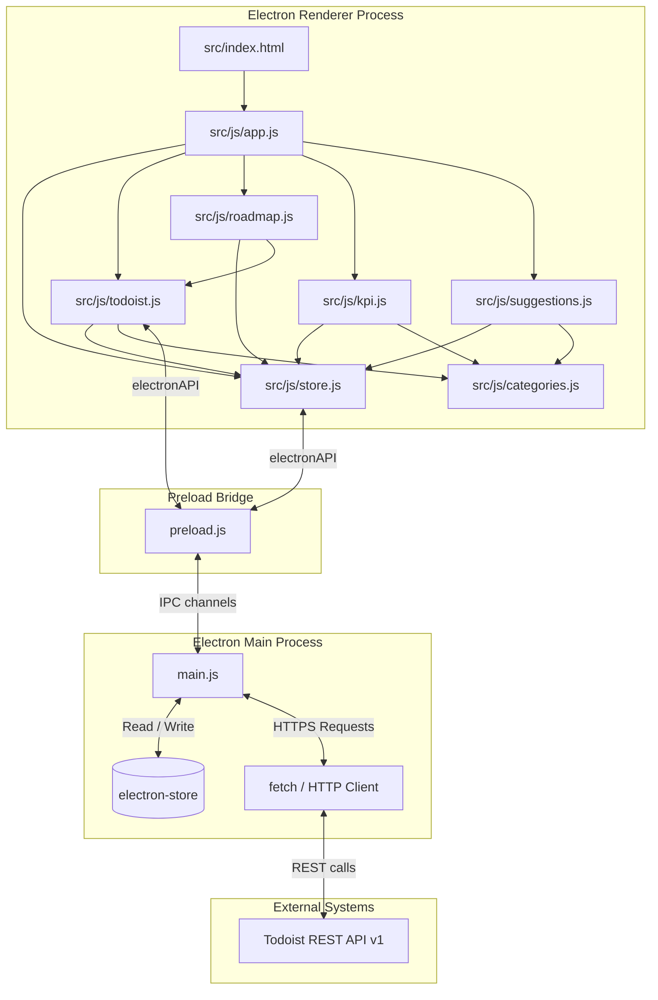

# 🏛️ System Architecture

SideQuest Achiever is structured as a security-isolated Electron desktop application. It enforces a strict separation of concerns between system operations (Main Process) and user interface operations (Renderer Process), communicating via an IPC bridge.

---

## 🗺️ High-Level Component Diagram

The following diagram illustrates the architecture of SideQuest Achiever and the data flows between its components:



---

## 📦 Component Responsibilities

### 1. Main Process (`main.js`)
*   **Window Management:** Spawns and configures the `BrowserWindow` with native borderless decoration (`frame: false`, `titleBarStyle: 'hidden'`).
*   **Data Persistence:** instantiates `electron-store` with default values and schema defaults.
*   **IPC Routing:** Registers handlers to listen to renderer queries:
    *   Window Actions (`window:minimize`, `window:maximize`, `window:close`).
    *   Store Actions (`store:get`, `store:set`, `store:delete`).
    *   Todoist REST APIs (`todoist:getProjects`, `todoist:createProject`, `todoist:getTasks`, `todoist:createTask`, `todoist:updateTask`, `todoist:closeTask`, `todoist:deleteTask`, `todoist:getLabels`, `todoist:createLabel`, `todoist:getSections`).
*   **Secure API Requests:** Acts as a secure server-side proxy requesting data from the Todoist endpoint (`https://api.todoist.com/api/v1`), keeping API tokens safely inside the Main Process environment.

### 2. Preload Bridge (`preload.js`)
*   Acts as a secure, sandboxed intermediary.
*   Uses Electron's `contextBridge` to expose a curated subset of APIs under `window.electronAPI`.
*   Avoids exposing raw `ipcRenderer` or Node.js primitives directly to the Renderer Process, protecting against XSS exploits.

### 3. Renderer Process Modules (`src/js/`)
*   [app.js](file:///c:/Users/MSI/Desktop/Projects/taskAchiever/src/js/app.js) (`App`): Coordinates global UI state, navigation views, new quest submissions, detail updates, click handlers, and binds sub-module initializers.
*   [store.js](file:///c:/Users/MSI/Desktop/Projects/taskAchiever/src/js/store.js) (`QuestStore`): Formulates requests sent through `electronAPI` to local storage. Coordinates stats logic (streaks, activity logging) and progress math.
*   [categories.js](file:///c:/Users/MSI/Desktop/Projects/taskAchiever/src/js/categories.js) (`Categories`): Evaluates quest metadata text using string matching to categorize quests.
*   [todoist.js](file:///c:/Users/MSI/Desktop/Projects/taskAchiever/src/js/todoist.js) (`TodoistSync`): Performs two-way synchronization: imports existing project items on first run, maps tasks to categories using section names, generates label overrides, and registers CRUD synchronization.
*   [roadmap.js](file:///c:/Users/MSI/Desktop/Projects/taskAchiever/src/js/roadmap.js) (`Roadmap`): Controls nested task-list items, handles drag-and-drop re-ordering, toggles completed states, and triggers TodoistSync subtask updates.
*   [llm.js](file:///c:/Users/MSI/Desktop/Projects/taskAchiever/src/js/llm.js) (`LLM`): Handles AI interactions for generating roadmap steps from quest titles.
*   [kpi.js](file:///c:/Users/MSI/Desktop/Projects/taskAchiever/src/js/kpi.js) (`KPI`): Compiles metrics (avg fulfillment stars, category distributions, streaks) and renders charts and the SVG activity matrix.
*   [suggestions.js](file:///c:/Users/MSI/Desktop/Projects/taskAchiever/src/js/suggestions.js) (`Suggestions`): Evaluates categories and generates personalized recommendation cards.

---

## 💾 Local Storage Schema (`sidequest-data.json`)

The application persists data structure through local JSON keys:

```json
{
  "todoistApiKey": "7511422301aff1a77af73d030a8daad9218f6e30",
  "todoistProjectId": "string | null",
  "todoistImported": "boolean",
  "quests": [
    {
      "id": "string (unique)",
      "title": "string",
      "description": "string",
      "category": "adventure | creative | scholarly | achievement",
      "difficulty": "number (1-5)",
      "dueDate": "string (YYYY-MM-DD) | null",
      "todoistId": "string | null",
      "createdAt": "string (ISO)",
      "steps": [
        {
          "id": "string",
          "text": "string",
          "completed": "boolean",
          "todoistId": "string | null",
          "createdAt": "string (ISO)",
          "completedAt": "string (ISO) | null"
        }
      ]
    }
  ],
  "completedQuests": [
    {
      "...QuestFields": "value",
      "completedAt": "string (ISO)",
      "fulfillment": "number (1-5) | null"
    }
  ],
  "settings": {
    "syncEnabled": "boolean",
    "yearlyGoal": "number"
  },
  "stats": {
    "totalCompleted": "number",
    "currentStreak": "number",
    "longestStreak": "number",
    "lastActiveDate": "string (YYYY-MM-DD) | null",
    "experiencePoints": "number",
    "streakFreezes": "number"
  },
  "activityLog": {
    "YYYY-MM-DD": "number (quest count completed on this day)"
  }
}
```

---

## 🔄 Synchronization Workflows

### 1. Quest Creation Flow
1. User submits quest in `App` dialog.
2. `QuestStore` appends local item, generates a local ID, and updates the local store.
3. `TodoistSync` catches the event, issues an API POST call to create the task, and returns the Todoist ID.
4. `QuestStore` updates the local quest with the newly-created `todoistId` for future reference.

### 2. Checklist / Step Operations
1. User appends a step in the detail panel.
2. `Roadmap` triggers `QuestStore.addStep`.
3. If the quest is linked to Todoist (`todoistId` is present), `TodoistSync` calls the API to create a Todoist subtask (with `parent_id` matching the parent quest's Todoist ID) and links the step.
